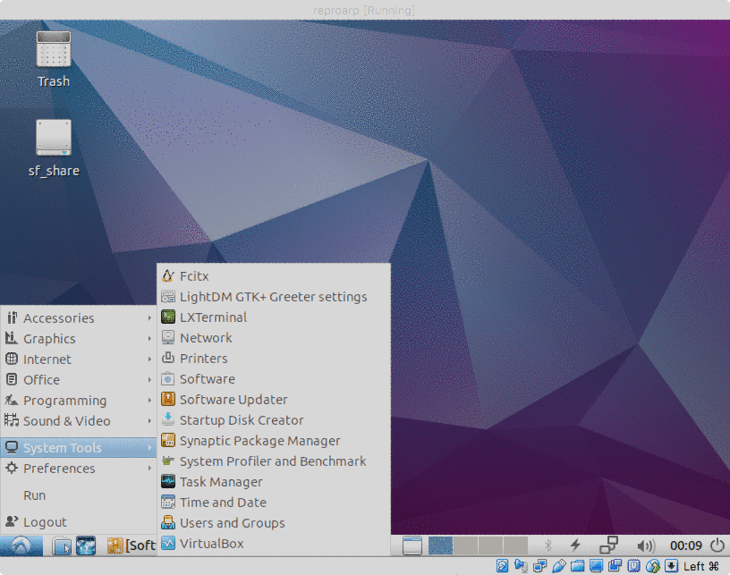

Introductions
===========================

This document contains detailed instructions for reproducing the radio model of the source Arp 299-B AT1 used in the paper by S. Mattila, M. Perez-Torres, A. Efsthatiou, P. Mimica and others. The paper is titled "A dust-enshrouded tidal disruption event with a resolved radio jet in a galaxy merger" and can be found [here](http://science.sciencemag.org/content/early/2018/06/13/science.aao4669.full).

This part of the work has been prepared by Petar Mimica (<petar.mimica@uv.es>).

Note that the data files used to make final plots are separately provided, in case the technical conditions (see below) are not met to fully reproduce the results from scratch.

Screenshots
==

The following image shows an animation of the screenshots from within a virtual machine. These are the steps that need to be performed in order to run the simulations and reproduce the results.

Prerequisites
==

The following software and libraries are needed to be able to reproduce the radio figures:

1. [VirtualBox](https://www.virtualbox.org/wiki/Downloads)
2. [Python](https://www.python.org/)
    1. [Pandas Data Analysis Library](https://pandas.pydata.org/)
	2. [matplotlib](https://matplotlib.org/)
	3. [Numpy](http://www.numpy.org/)
	4. [seaborn](https://seaborn.pydata.org/)
3. A machine with **at least 25 GB of RAM** and **at least 4 cores** (recommended: >32 GB RAM, >16 cores). The full results **cannot** be reproduced using machine with less than 25 GB of RAM.

Downloading the virtual machine
===

The virtual machine (VM) is saved in [Open Virtualization Format](https://en.wikipedia.org/wiki/Open_Virtualization_Format). It can be imported into VirtualBox by choosing `File`->`Import Appliance` (or similar).

The VM (approximately 3GB in size) can be downloaded from [https://drive.google.com/uc?id=1QMh8EsvgyPDq_FzxJdTOUnSZT6woNRiV&export=download](https://drive.google.com/uc?id=1QMh8EsvgyPDq_FzxJdTOUnSZT6woNRiV&export=download). If a warning appears, you need to choose `Download anyway`.

Configuring the VM
===

After the file has been imported in VirtualBox, a new VM called `reproarp` appears in the VM selector. The user should configure the number of CPUs (4 by default) and, if possible, increase the available RAM (25000 MB by default). Finally, the user should change the path of the shared folder (the default is set to `/Users/pere/repshare`, which probably does not exist on user machine) to a directory of choice. This directory can be used to exchange data between the VM and the host machine. Inside the VM the same directory is mounted under `/media/sh_repshare`. Note that it may be prudent to copy the whole working directory (see below) to the shared folder of the host machine and run the code there, to avoid the VM running out of disk space.

Running the VM
===

Once configured, the VM can be started. By default the user is automatically logged-in. The username is `user`, and the password is `repro2018`. This can be used to change the system configuration or to update the operating system (if decired, though it is not necessary for running the codes).

Inside the VM the terminal should be opened by clicking on the system menu symbol in the lower left corner, then selecting `System tools` -> `LXTerminal`. Then the user should change to the `work` directory where four subdirectories are found:

* `hydro_simulation`
* `SPEV_preprocess`
* `SPEV_postprocess`
* `grid`

The hydro simulation should be run first. Afterward the preprocessing and postprocessin phases should be run every time the microphysical parameters are changed.

Running the hydro simulation
==

In the `hydro_simulation` directory there is a README.txt file explaining how to run the simulation and how to measure the jet mass and energy. Once the measurement has been performed, the resulting file (called `massen.dat` in the example) should be copied to the host machine (e.g. via the shared folder). The code executable is a version of [MRGENESIS](http://adsabs.harvard.edu/cgi-bin/nph-data_query?bibcode=2009A%26A...494..879M&db_key=AST&link_type=ABSTRACT&high=56a5dd85cb13628) adapted to this problem.

Running the preprocessor
==

In the `SPEV_preprocess` file there is a README.txt file explaining what should be done. The microphysical parameters of the jet (epsilon_e, epsilon_B, zeta_e, p) are found in `nonthermal.params`.

The file `fsp-pos.dat` should be copied to the host machine. Together with `massen.dat`, it is used to produce Fig S6, as well as to compute the points in the lower panel of  Fig. 2.

The codes in this directory are part of the [SPEV code](http://adsabs.harvard.edu/abs/2016JPhCS.719a2008M).

Running the postprocessor
==

To produce the final light curve the postprocessor in `SPEV_postprocess` should be used. Ther eis a README.txt file explaining what must be done. **Warning**: this step takes approximately 20 GB of RAM.

After the light curves produced by the postprocessor have been converted to the four text files, these should be copied to the host machine. They are used to produce the upper panel of Fig. 2.

The code in this directory is a part of the [SPEV code](http://adsabs.harvard.edu/abs/2016JPhCS.719a2008M).

Producing the final plots
==

There are two `Python 3` files that can be used to produce the final plots.

1. Radio light curve: use the file [radio_lc.py](./radio_lc.py). Edit the file names in lines 4 and 7 to match those produced by the postprocessor, and select the desired figure file name (`'lc'` in the default example). Run the script using `Python 3.
2. Beta and energy figure: use the file [beta_energy.py](./beta_energy.py). Edit the file names in lines 4, 7, 10 and 13 to match those produced by measuring the simulation (`'massen.dat'` in the default example) and by the preprocessor (`'fsp-pos.dat'`). The code creates the two figues, and also outputs data used in the lower panel of Fig. 2.

Creating a grid of models
==

In the directory `grid` there is a script that generates 15 models that can be used to create a parameter search grid around our best fit model. Please read the `README.txt` in that directory.
